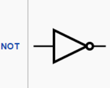
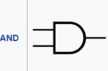
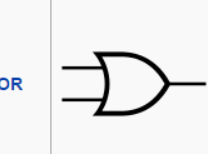
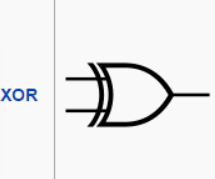

# Project 1: Elementary Logic Gates

## 基礎邏輯閘

### Nand (基本元件)
- **功能**: NAND (非與) 邏輯運算
- **輸入**: a, b
- **輸出**: out
- **真值表**:
  ```
  a | b | out
  ---+---+-----
  0 | 0 | 1
  0 | 1 | 1
  1 | 0 | 1
  1 | 1 | 0
  ```
- **備註**: 本專案中作為所有邏輯閘的基本構建模組

### Not
- **功能**: 輸出輸入值的反相
- **輸入**: in
- **輸出**: out
- **實現方式**: 使用 Nand 閘構建
- **邏輯表達式**: out = NOT in

    

### And
- **功能**: 邏輯 AND 運算
- **輸入**: a, b
- **輸出**: out
- **實現方式**: 使用 Nand 和 Not 閘構建
- **邏輯表達式**: out = a AND b

    

### Or
- **功能**: 邏輯 OR 運算
- **輸入**: a, b
- **輸出**: out
- **實現方式**: 使用 Nand 閘構建
- **邏輯表達式**: out = a OR b

    
### Xor
- **功能**: 邏輯 XOR 運算
- **輸入**: a, b
- **輸出**: out(奇數個1時，輸出爲1；否則為0)
- **實現方式**: 使用 Nand、And、Or 閘構建
- **邏輯表達式**: out = (a AND NOT b) OR (NOT a AND b)

    

## 多工選擇器與解多工選擇器

### Mux
- **功能**: 根據選擇位元選擇一個輸入
- **輸入**: a, b, sel
- **輸出**: out
- **功能描述**:
  - 當 sel = 0 時，輸出 a
  - 當 sel = 1 時，輸出 b
- **實現方式**: 使用基礎邏輯閘構建

### DMux
- **功能**: 將單一輸入分配到兩個輸出之一
- **輸入**: in, sel
- **輸出**: a, b
- **功能描述**:
  - 當 sel = 0 時：a = in, b = 0
  - 當 sel = 1 時：a = 0, b = in
- **實現方式**: 使用基礎邏輯閘構建

## 16位元邏輯閘

### Not16
- **功能**: 對16位元輸入執行位元反相運算
- **輸入**: in[16]
- **輸出**: out[16]
- **操作**: 對每個位元執行 NOT 運算
- **實現方式**: 使用16個 Not 閘並聯

### And16
- **功能**: 對兩個16位元輸入執行位元 AND 運算
- **輸入**: a[16], b[16]
- **輸出**: out[16]
- **操作**: out[i] = a[i] AND b[i]，對所有 i = 0..15
- **實現方式**: 使用16個 And 閘並聯

### Or16
- **功能**: 對兩個16位元輸入執行位元 OR 運算
- **輸入**: a[16], b[16]
- **輸出**: out[16]
- **操作**: out[i] = a[i] OR b[i]，對所有 i = 0..15
- **實現方式**: 使用16個 Or 閘並聯

### Mux16
- **功能**: 根據選擇位元選擇一個16位元輸入
- **輸入**: a[16], b[16], sel
- **輸出**: out[16]
- **功能描述**:
  - 當 sel = 0 時：out = a
  - 當 sel = 1 時：out = b
- **實現方式**: 使用16個 Mux 閘並聯

## 多工選擇器擴展

### Or8Way
- **功能**: 對8個輸入執行 OR 運算
- **輸入**: in[8]
- **輸出**: out
- **操作**: out = in[0] OR in[1] OR ... OR in[7]
- **實現方式**: 使用樹狀結構的 Or 閘構建

### Mux4Way16
- **功能**: 從4個16位元輸入中選擇一個
- **輸入**: a[16], b[16], c[16], d[16], sel[2]
- **輸出**: out[16]
- **選擇邏輯**:
  - sel = 00: 輸出 a
  - sel = 01: 輸出 b
  - sel = 10: 輸出 c
  - sel = 11: 輸出 d
- **實現方式**: 使用多個 Mux16 閘層級連接

### Mux8Way16
- **功能**: 從8個16位元輸入中選擇一個
- **輸入**: a[16], b[16], c[16], d[16], e[16], f[16], g[16], h[16], sel[3]
- **輸出**: out[16]
- **選擇邏輯**: 根據3位元選擇信號 sel 選擇對應的輸入
- **實現方式**: 使用多個 Mux16 和 Mux4Way16 閘層級連接

## 解多工選擇器擴展

### DMux4Way
- **功能**: 將單一輸入分配到四個輸出之一
- **輸入**: in, sel[2]
- **輸出**: a, b, c, d
- **分配邏輯**:
  - sel = 00: a = in, 其他輸出 = 0
  - sel = 01: b = in, 其他輸出 = 0
  - sel = 10: c = in, 其他輸出 = 0
  - sel = 11: d = in, 其他輸出 = 0
- **實現方式**: 使用多個 DMux 閘層級連接

### DMux8Way
- **功能**: 將單一輸入分配到八個輸出之一
- **輸入**: in, sel[3]
- **輸出**: a, b, c, d, e, f, g, h
- **分配邏輯**: 根據3位元選擇信號 sel 將輸入分配到對應的輸出
- **實現方式**: 使用多個 DMux 和 DMux4Way 閘層級連接

## 建構層級關係

```
Nand (基礎)
  ├── Not
  ├── And
  └── Or
      └── Xor
          ├── Mux
          └── DMux
              ├── Not16 (16個Not並聯)
              ├── And16 (16個And並聯)
              ├── Or16 (16個Or並聯)
              ├── Mux16 (16個Mux並聯)
              ├── Or8Way (樹狀Or結構)
              ├── Mux4Way16 (基於Mux16)
              ├── Mux8Way16 (基於Mux4Way16)
              ├── DMux4Way (基於DMux)
              └── DMux8Way (基於DMux4Way)
```
