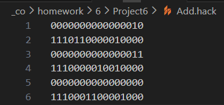
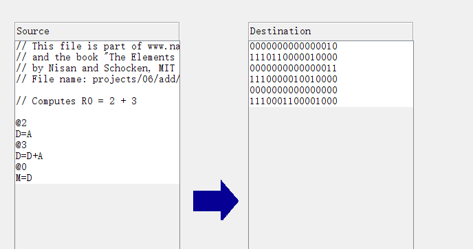
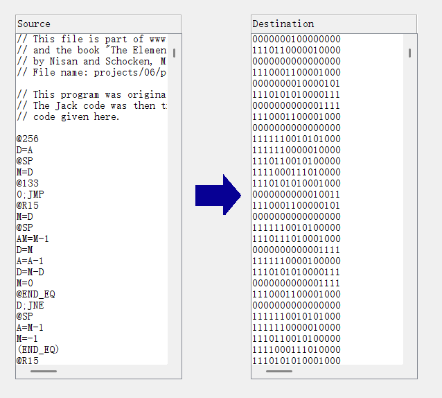

# Project 6: Hack Assembler

這是我為 **Nand2Tetris** 課程（Project 6）實作的 Hack 組合語言組譯器（Assembler）。此程式能將 Hack 組合語言（`.asm`）翻譯成可執行的二進位機器碼（`.hack`）。

## 📝 專案目標 (Objective)

根據課程規範，本專案的目標是開發一個組譯器，能夠讀取含有 Hack 組合語言指令的文字檔，並輸出對應的 Hack 二進位代碼檔案。產出的 `.hack` 檔案內容必須與課程提供的標準組譯器產出的結果完全一致。

## ⚙️ 功能特性 (Features)

* **基本翻譯**：支援所有 Hack 語言的 A-instruction 與 C-instruction。
* **符號處理 (Symbol Handling)**：實作了符號表（Symbol Table），能夠處理：
    * 預定義符號 (Predefined symbols, e.g., `R0`, `SCREEN`, `KBD`)
    * 標籤符號 (Label symbols, e.g., `(LOOP)`)
    * 變數符號 (Variable symbols, e.g., `@i`)
* **格式處理**：能夠忽略程式碼中的空白 (White space) 與註解 (Comments) 。
* **相容性**：針對 C-instruction 的目的地，支援標準寫法（如 `MD`）以及部分非標準寫法（如 `DM`），符合專案對於已知問題的處理建議 。

## 🛠️ 開發與實作 (Development Stages)

本專案依照建議分為兩個階段進行開發與測試 ：

1.  **Stage I (Basic Assembler)**：
    * 僅處理沒有符號的組合語言程式。
    * 測試檔案：`Add.asm`, `MaxL.asm`, `RectL.asm`, `PongL.asm` 。
2.  **Stage II (Symbol Handling)**：
    * 加入符號解析功能（Symbol Table）。
    * 測試檔案：`Max.asm`, `Rect.asm`, `Pong.asm` 。

## 🚀 如何執行 (Usage)

### 環境需求
* python

### 執行指令
在終端機 (Terminal) 中執行以下指令：

```bash
# python assembler.py [檔名.asm]
python assembler.py Add.asm
```
### 產生檔案

執行完程式以後，產生.hack檔

* 執行完程式以後，產生Add.hack檔,內容如下圖所示：



* 執行完程式以後，產生Max.hack檔

* 執行完程式以後，產生Rect.hack檔

* 執行完程式以後，產生Pong.hack檔

### 比對是否正確

在Assembler上執行.asm，比對是否和原本的.hack檔相同

* 在Assembler上執行Add.asm



* 在Assembler上執行Max.asm


* 在Assembler上執行Rect.asm


* 在Assembler上執行Pong.asm



## 參考資源

*   [nand2tetris](https://drive.google.com/file/d/1CITliwTJzq19ibBF5EeuNBZ3MJ01dKoI/view)
*   [deepseek對話網址](https://chat.deepseek.com/share/xllgp004g7q23k98zc)